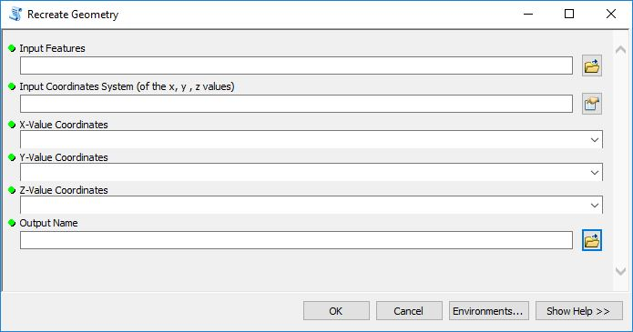

# Recreate Geometry
Assigns geometrical attributes to the geometry of a point (X, Y, Z), and creates a new feature class. Used when using GNSS GPS receivers with Collector to re-populate the Z-values in the correct coordinate system.

Supported in at least ArcGIS 10.3.x+ and ArcGIS Pro 1.2+

This tool is used convert attributes to geometries. The main use case for this is when using GNSS GPS receivers with the collector app, the meta data is stored (receiver name, lat, long, altitude, accuracy...) in the attribute table but the 3D z-values may not be projected properly when stored in the database. 

Suppose you have feature that has the following attributes where the geometry (X and Y) of the features has been projected to NAD83, but the Lat, Long, and Z attributes are still in WGS84. 

| ObjectID | Shape   | Lat       | Long        | Z         |
|----------|---------|-----------|-------------|-----------|
| 1        | Point   | 34.057866 | -117.196879 | 369.05957 |

This tool will create a new feature class that uses the Lat, Long, and Z attributes to create the geometry (using the orginal projection: WGS84). It carries over any other attributes as well.

### Using as a Script Tool within ArcMap or ArcGIS Pro:

1. Connect to the folder containing the "CollectorUtils" toolbox
2. Double click on the "CollectorUtils" toolbox that should be shown in the catalog/project area
3. Double click the "Recreate Geometry" script tool (in the "OfflineUtils" toolset)
4. Choose your inputs
    1. Input Features - This is the point feature class that you would like to update the geometry of and project
    2. Input Coordinate System - This is the Coordinate System of the X (long), Y (long), and Z (altitude) values. NOT necessarily the CS of the feature class
    3. X-Value Coordinates - The field that stores the X values or Longitude information (attempts to auto-populate)
    4. Y-Value Coordinates - The field that stores the Y values or Latitude information (attempts to auto-populate)
    5. Z-Value Coordinates - The field that stores the Z values or Elevation/Altitude information (attempts to auto-populate)
    6. Output Features - The location of the output feature class
5. Click Run



### Re-building the toolbox (for versions lower than 10.4)
1. Create a new toolbox (if you don't already have one)
2. Add the recreate_geometry.py as a script
3. Set the parameters as follows:

    | Display Name            | Data Type         | Type     | Direction | Filter                             |
    |-------------------------|-------------------|----------|-----------|------------------------------------|
    | Inpute Feature          | Feature Class     | Required | Input     | Feature Class                      |
    | Input Coordinate System | Coordinate System | Required | Input     | None                               |
    | X-Value Coordinates     | Field             | Required | Input     | None (obtained from Input Feature) |
    | Y-Value Coordinates     | Field             | Required | Input     | None (obtained from Input Feature) |
    | Z-Value Coordinates     | Field             | Required | Input     | None (obtained from Input Feature) |
    | Output Name             | Feature Class     | Required | Output    | Feature Class                      |

4. Update the validation logic to attempt to pre-populate coordinate fields and check for VCS

```python
    import arcpy
    class ToolValidator(object):
      def __init__(self):
        """Define the tool (tool name is the name of the class)."""
        self.parameters = arcpy.GetParameterInfo()
    
      def initializeParameters(self):
        pass
    
      def updateParameters(self):
        """Modify the values and properties of parameters before internal
        validation is performed.  This method is called whenever a parameter
        has been changed."""
    
        # Attempt to auto-populate the fields based on their names
        if self.parameters[0].altered:
          in_field_names = [field.name for field in arcpy.Describe(self.parameters[0].valueAsText).fields if
                            field.type in ("Double", "Long", "Short", "Integer", "Single", "SmallInteger")]
          for field_name in in_field_names:
            if any(x in field_name.lower() for x in ("longitude", "long")) or "x" == field_name.lower():
              self.parameters[2].value = field_name
              break
          for field_name in in_field_names or "long" in field_name.lower() or "y" == field_name.lower():
            if any(x in field_name.lower() for x in ("latitude", "lat")):
              self.parameters[3].value = field_name
              break
          for field_name in in_field_names:
            if any(x in field_name.lower() for x in ("elevation", "elev", "altitude", "height", "depth")) or \
                            "z" == field_name.lower():
              self.parameters[4].value = field_name
              break
        return
    
      def updateMessages(self):
        """Modify the messages created by internal validation for each tool
        parameter.  This method is called after internal validation."""
    
        # Check to see if the input FC has Z-values enabled
        # If not, set a warning
        if self.parameters[0].value is not None:
          if not arcpy.Describe(self.parameters[0].value).hasZ:
            self.parameters[0].setWarningMessage("This layer does not contain z-values.\
                   Z-values will be added to the output.")
          else:
            self.parameters[0].clearMessage()
        # Check to see if the input Spatial Reference has a VCS
        # If not, then show an error
        if self.parameters[1].value is not None:
          if "vertcs" not in self.parameters[1].valueAsText.lower():
            self.parameters[1].setErrorMessage("Requires Vertical Coordinate System")
          else:
            self.parameters[1].clearMessage()
        return
```

### Using as a standalone script
Run the [recreate_geometry.py](recreate_geometry.py) script in either Python 2.7+ or Python 3.4+
```python
    python recreate_geometry.py <FQP to feature class> <input spatial reference as string> <x-field> <y-field> <z-field> <FQP to output feature class>
```

Example:
```python
    python recreate_geometry.py "C:/Temp/Temp.gdb/Test" "GEOGCS['GCS_WGS_1984',DATUM['D_WGS_1984',SPHEROID['WGS_1984',6378137.0,298.257223563]],PRIMEM['Greenwich',0.0],UNIT['Degree',0.0174532925199433]],VERTCS['WGS_1984',DATUM['D_WGS_1984',SPHEROID['WGS_1984',6378137.0,298.257223563]],PARAMETER['Vertical_Shift',0.0],PARAMETER['Direction',1.0],UNIT['Meter',1.0]]" "ESRIGNSS_LONGITUDE" "ESRIGNSS_LATITUDE" "ESRIGNSS_ALTITUDE" "C:/Temp/Output.gdb/Output3"
```

### What it does
1. Checks that all of the specified fields exist
2. Creates a new feature class
3. Creates new features in the feature class by iterating through the features of the input feature class